# Reflektion

## Kapitel 2: Meaningful Names
Det som jag tycker är mest intressant i detta kapitel är uttrycket ***Clarity is King!***. Jag tycker att det förklarar på ett bra sätt vad som är viktigt. Exempelvis att vi ska använda oss utav vissa regler när vi skapar bra och tydliga variabel namn. Några av de viktigaste reglerna som jag tycker är *Use Intention-Revealing Names*, *Avoid Disinformation* och *Use Pronounceable Names*. *Magiska nummer* är en sak som jag jobbade mycket på att förändra i L2 då jag märkte att jag använde mig utav det mycket. Efter att jag skapade en variabel med ett tydligt namn så blev det mycket lättare att förstå vad nummret gjorde. 

### Exempel: ***HorizontalBarDiagram.js***

I den gammla versionen är et extremt svårt att veta vad de olika numren betyder. I den nya version är det betydligt mycket enklare att förstå vad de olika numren betyder.

Dåligt:

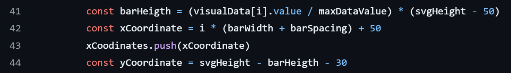

Bra:

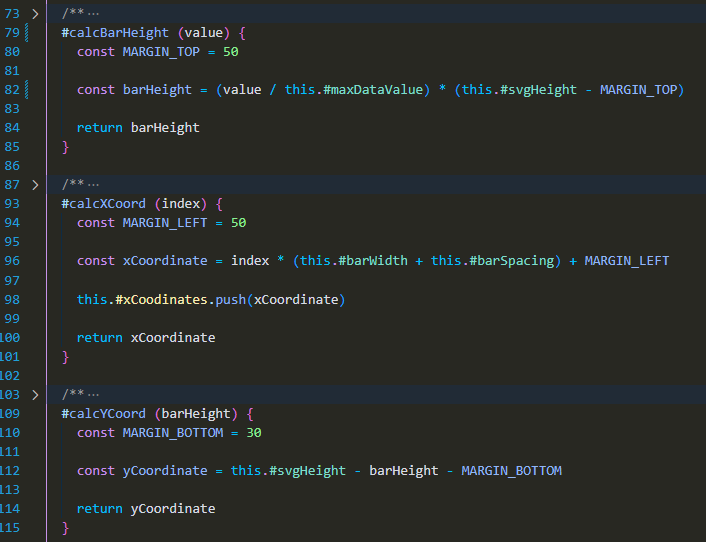

## Kapitel 3: Functions

Många bra saker som nämns i detta kapitel så som **Small**, **Do One Thing**, **Use Descriptive Names** och **Command Query Seperation**. I fösta versionen kunde man argumentera att metoderna var korta och gjorde en sak. Men efter att jag refaktoriserade koden så kan jag nu erkänna att det gick och göra den mindre och därav kunde varje metod göra en sak. Det negativa med att ha fler metoder tycker jag är att det blir fler arguement att skicka. Det är också en sak som boken nämre är dåligt att ha för många argument. Efter att refaktoriserat koden kan jag hålla med om att det är bättre desto färre argument som skickas mellan metoderna. Oftast löste jag det genom att skapa en datastruktur som det så fint heter och skickade den som argument istället. Därav tycker jag att max 3 argument är en bra regel att följa. Två saker som jag tycker har varit svårt och följa är **One level of abstraction per function** och **Command Query Seperation**. Den sistnämde tycker jag är intressant och jag skulle vilja lära mig mer om det. Dock tror jag att det blir enklare om man använder det konceptet från början.

### Exempel: ***HorizontalBarDiagram.js***

Den dåliga versionen överstämmer inte alls med vad boken vill få ut för budskap ifrån detta kapitel. Den är helt kass egentligen. Däremot tycker jag att den nya versionen är mycket bättre och tydligare. Då jag har brytit ut vissa delar till egna metoder och därav har varje metod en sak att göra.

Dåligt:

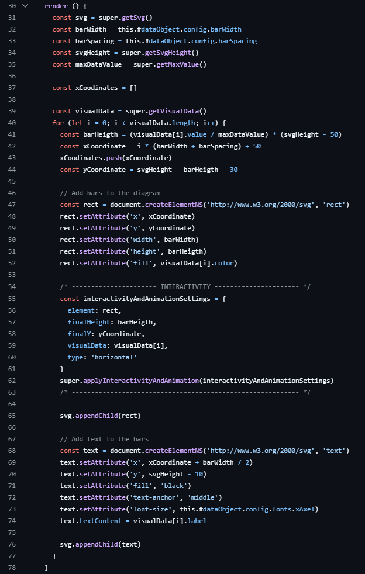

Bra:

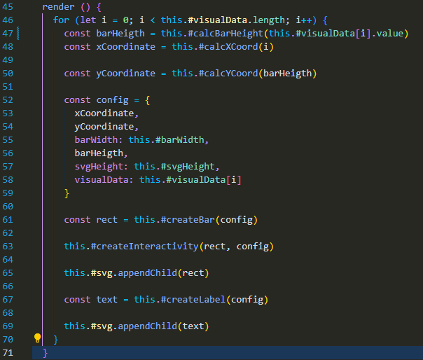

## Kapitel 4: Comments
Jag håller helt med om att man ska försöka minska antalet kommenterer om man kan skriva självdokumeterande kod istället. Detta är dock en regel som jag inte har följt så mycket eftersom jag använder skolans lintning som kräver kommentarer överralt. Nästan som alltid när jag skriver kommentarer så tillför det inte så mycket mer information än vad namnget redan gör. Det är lite som Robert C. Martin säger i boken att kommentarer är en nödvändig ondska. En kommentar är bra så länge den kan tillföra ny information som vi inte direkt kan läsa oss till i koden. Men det viktigaste som jag kommer att ta med mig från detta kapitel är att försöka skriva kod som är självdokumenterande. Robert beskriver detta som **Explain yourself in code**. Ett annat intressant fras/koncept är **Comments do not make up for bad code**. Det är något som visar på att vi ska lägga vår energi på att skriva bra och självdokumenterande kod istället för att skriva kommentarer.

### Exempel: ***HorizontalBarDiagram.js***
Den första är extremt dåligt kommenterad. Det är inte mycket att förklara mer än att metoden renderar diagrammet. Däremot kunde jag skrivit den bättre genom att skriva att metoden renderar diagrammet och lägger till den i DOM. Den andra är bättre kommenterad. Men egentligen är den ganska onödig eftersom namnet på metoden redan förklarar vad den gör.

Dåligt:

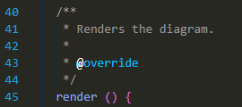

Bättre:

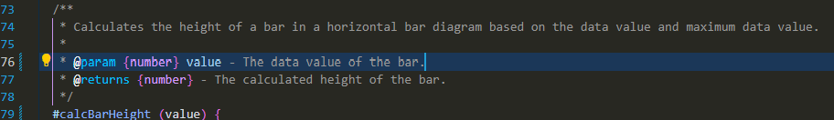

## Kapitel 5: Formatting
Robert har ju helt rätt i att om vi formaterar vår kod blir det betydligt mycket enklare att läsa vilket ökar kodförståelsen. Egentligen tycker inte jag att jag har förändrat mitt sätt att koda så mycket beroende på detta kapitel. Jag indenterar, grupperar och använder tomma rader för att göra koden mer luftig (**Vertical Density**). Jag jobbade inte med **Vertivcal Distance** i L2 version 1. Jag har däremot jobbat mer med detta då jag har refaktoriserat koden och försökt lägga den när till hand. Jag vet att jag någonstans i koden (mycket if else), jag inte kan använda mig utav en tom rad för att göra koden mer luftig eftersom då bryter jag mot lintningen.

### Exempel: ***my-show-diagram.js*** and ***my-create-diagram.js***
Dem första är svårläst och bara allmänt rörigt. Den andra är mycket bättre och lättare att läsa.

Dåligt:

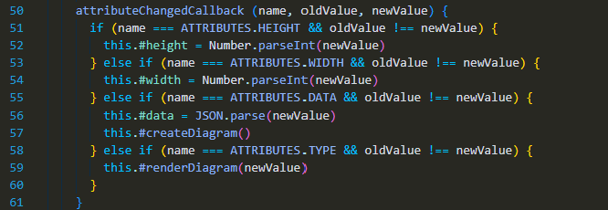

Bättre:

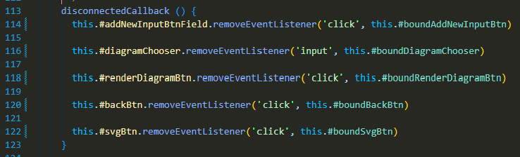

## Kapitel 6: Objects and Data Structures
Jag vet inte om jag riktigt är 100% met på skillnaden på **Objects** och **Data Structures** ännu. Jag vet inte om jag tänker rätt eller fel men ett objekt är en klass, medans data struktur är något som man skapar för att samma värden på variabler på ett och samma ställe. **Law of Demeter** och **Train Wrecks** verkar höra ihop väldigt mycket. Då om jag tolkat rätt så ofta när man bryter mot **Law of Demeter** så blir det ofta **Train Wrecks**. Så som jag tolkar **Law of Demeter** så är det när man anropar en metod på ett objekt som jag inte direkt har en koppling till. Och **Train Wreck** är när man anropar en metod på ett objekt och sedan anropar man en metod på det objektet och så vidare.

### Exempel: ***HorizontalBarDiagram.js***
Jag har använt mig utav data strukturer för att skicka in argument till metoder. 

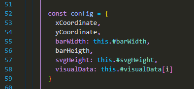

## Kapitel 7: Error Handling
Återigen ett bra och intressant kapitel som Robert har fått till. **Use Exceptions Rather Than Return Codes** tycker jag låter väldigt bra. Då jag tycker att det är mycket enklare att förstå vad som har gått fel. **Write your try-catch-fianally statements first** tycker jag är logiskt att de borde vara det första som skrivs och att de placeras så lång ut som möjligt (app.js). Som jag skrev innan för att veta vad som gick fel ska vi anända oss utav reglen **Provide context with exceptions**. Det är viktigt att vi vet vad som gick fel och varför det gick fel. **Dont return null** beskriver Robert som att vi ska absolut undvika då det är betydöigt mycket bättre att kasta ett exception. Vilket vi får mer inforamation infrån.

### Exempel: ***DataObjects.js*** and ***DiagramFactory.js***

Iden första bilden kastar jag undantag och berättar vad som gick fel. I den andra bilden fångar jag undantaget så långt ut som möjligt och skriver ut det i konsolen.

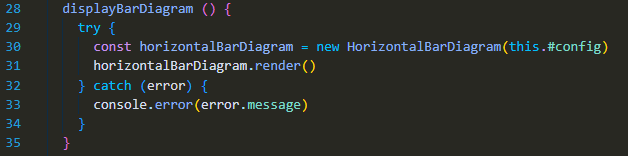

## Kapitel 8: Boundaries
Jag vet inte om jag rikgtigt hänger med på vad Robert menar med **Using Third-Party Code**. När vi använder oss utav tredjeparts bibliotek så blir vår kod beroende till detta bibliotek. Det är här jag antar att adaptern kommer till använding. Då adapterns uppgift är att sköta om all kommunikation mellan vår kod och biliotekets. Visst det tar bort det direkta beroendet från vår kod till biblioteket. Då borde vår kod ändå bli beroende till bilioteket fast dock via en adapter. Så jag antar att vår kod blir beroende till denna adapter som i sin tur är beroende till bilioteket? Jag antar att adaptern är till för att wrappa allt som har med bilioteket att göra? (**Wrapping Thrid-Party Code**) Så jag antar att Robet vill att vi ska försöka skydda oss så mycket som möjligt mot tredjeparts kod eftersom vi vet inte vilka ändringar som kan ske i den. Det är iallafall så jag tolkar kapitlet och adaptern.

### Exempel: ***my-show-diagram.js***
Jag har absolut inte skyddat mig mot detta idenna version utav koden. Däremot tror jag att jag är med på vad Robert menar. Jag tror dock att dett är viktigare att skydda sig mot tredjeparts kod i större projekt och som inte rör skolan. Men jag gillar tanken. I bilden visar jag hur jag just jag skapar/hanterar koden från mitt lib.

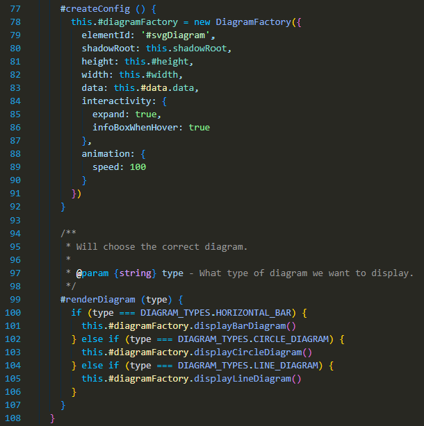

## Kapitel 9: Unit Tests
Robert beskriver i **The Three Laws if TDD** att vi ska skriva testerna först innan vi skriver koden som ska uppfylla testerna. Jag tycker att detta låter klokt, dock är det inget som jag jobbat med i denna uppgift men jag tror att jag eventuellt kommer at jobba mer med detta efter nästa kurs (testkursen). Det borde vara enklare att skriva tester som kollar om kravet uppfylls innan programmkoden är skriver. Detta borde göra det enklare att avgöra om min programkod fungerar som förväntat och om den uppfyller kravet. **Keeping Test Clean** menar Robert med att bra skrivna tester gör så att vår kod blir mer robust och flexibel vilket är bra. Två andra saker som jag gillar är **One assert per test** och **Single concept per test**. Så som jag förstår det så ska vi ska testa endast en sak per test. Detta gör att vi vet exakt vad som gick fel om testet misslyckas.

### Exempel: ***config.test.js***
Denna bild visar hur jag testar att min kod ska kasta ett undantag om den inte hittar elementet i DOM.

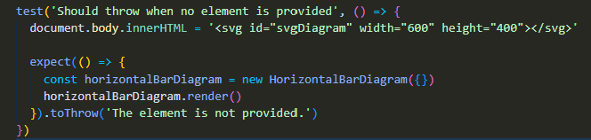

## Kapitel 10: Classes
I detta kaiptel förklara Robert att klasser ska använda **Encapsulation** och **Single Responsibility Principle**. Inkapsling tycker jag är väldigt logiskt och jag använder mig alltid utav detta när jag kan. Att klasser ska vara små (**Classes should be small**) och **Single Responsibility Principle**. Ja det ska vara små och göra en sak men det är inte alltid lätt. Tar vi mina 3 webbcomponenter som jag har jag inte att den följer dessa regler till punkt och pricka. Jag har många knappar som man hade kunnat bryta ut till egna componenter. och på det viset öka **Cohesion** plus **Single responsability**. Men kollar i modulen L2 källkod tycker jag att den följer dessa regler ganska bra. Då både line och bar har saker gemensamt så har jag skapat en parenklass som tillhandahåller skapandet utav griden.

### Exempel: ***GraphDiagram.js***
I denna bild visar jar klassen som skapar griden för diagrammet. Denna klass har en sak att göra och det är att skapa griden. Med grid menar jag X och Y axlen samt linjer för att läsa av värden på grafen.

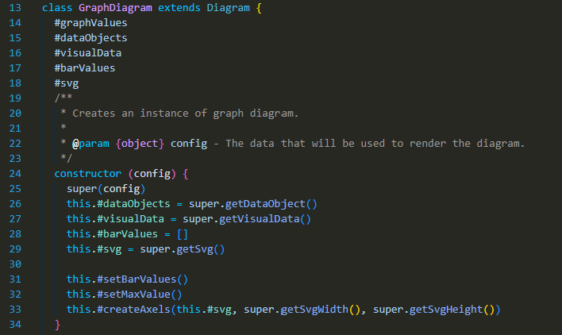

## Kapitel 11: Systems
Innan jag läste detta kapitel tror jag inte riktigt att jag förstod exakt vad som menades med **Dependency Injections**. Så som jag tolkar det sker detta när vi skickar object som argument instället för att instansiera ett nytt objekt. Vidare berättar Robert om **Factories** som används för att skapa upp nya instaser utav ett objekt. Men hjälpt utav en factory kan vi skapa upp nya instanser av ett objekt mycket enklare och effektivare. **Constructors must be simple** är ett stycket som jag inte följe i L2 men jag nu rättat till i L3. I L2 gjorde jag det för att jag ville automatiskt köra den metoden när jag skapade en ny instans av klassen. Men det är bättre att skapa en metod som vi får anropa istället. **Avoid duplication** är en regel som jag försöker följa så gott det går. Den handlar om att man inte ska upprepa sig. Jag tycker dock att det har varit enklare att hittat att man brutit mot denna regel på när man gör en code review. Jag gillar att efter ett projekt är klart går jag igenom filerna och kollar om jag hittar saker som jag kan förbättra. Dry brukar vara ett sådant men även att jag skapar nya mindre metoder som gör en sak. 

### Exempel: ***GraphDiagram.js***
Här visar jag när jag bryter mot reglen **Constructors must be simple**. I andra bilden visar jag hur jag har refaktoriserat koden  för att försöka följa regeln.

Dåligt:

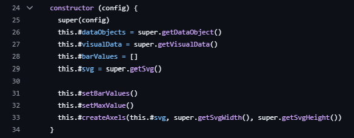

Bra: 

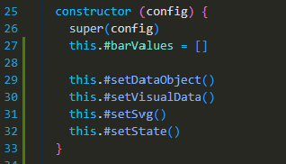

