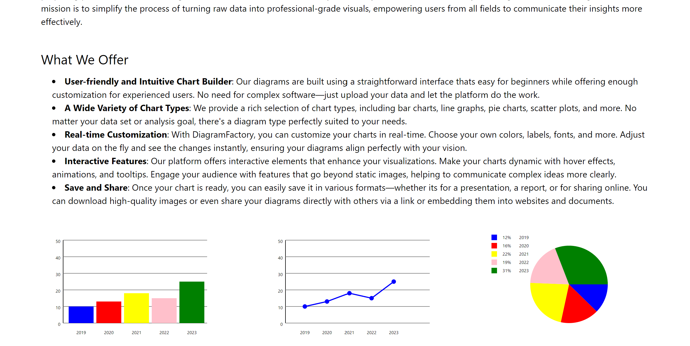
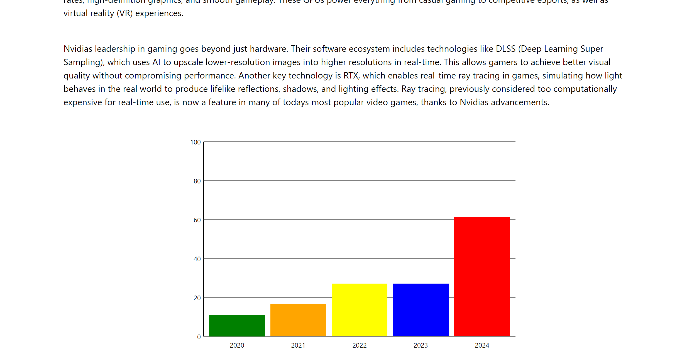
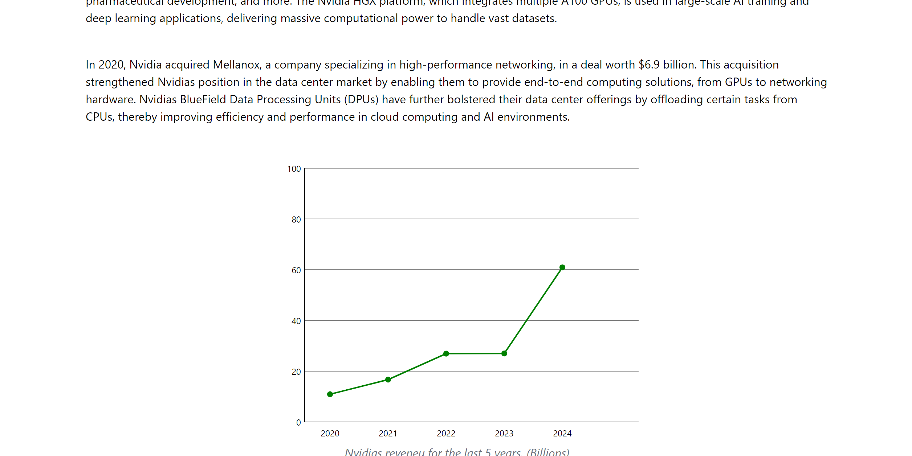
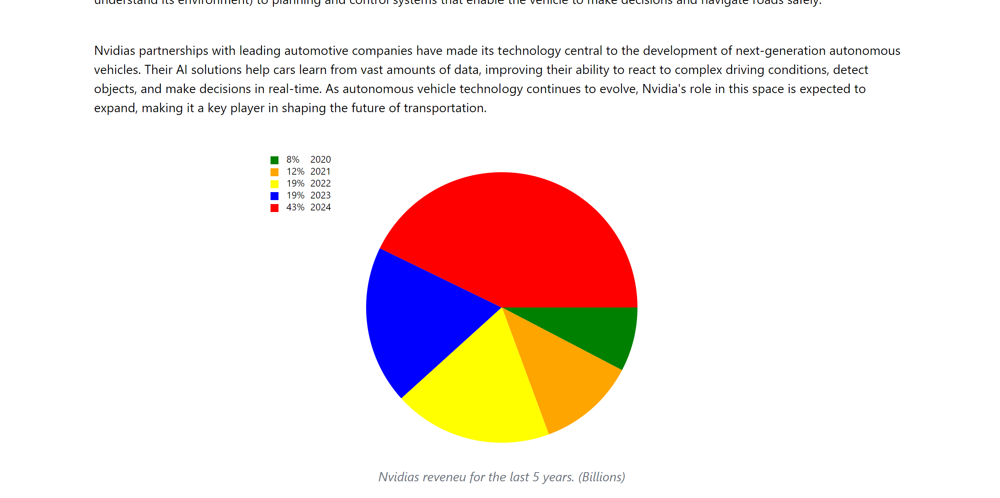
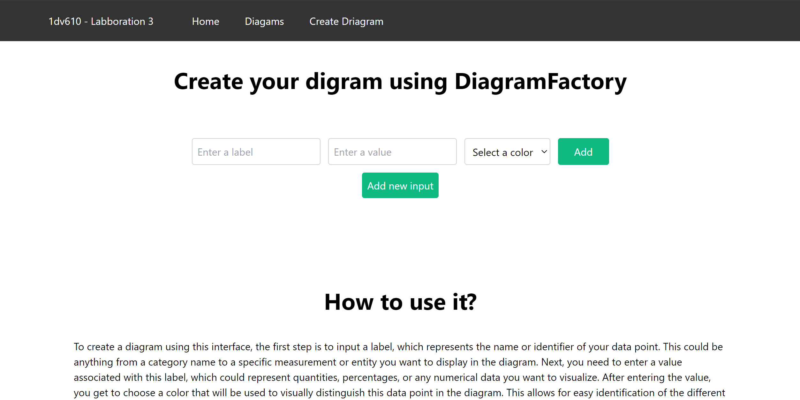
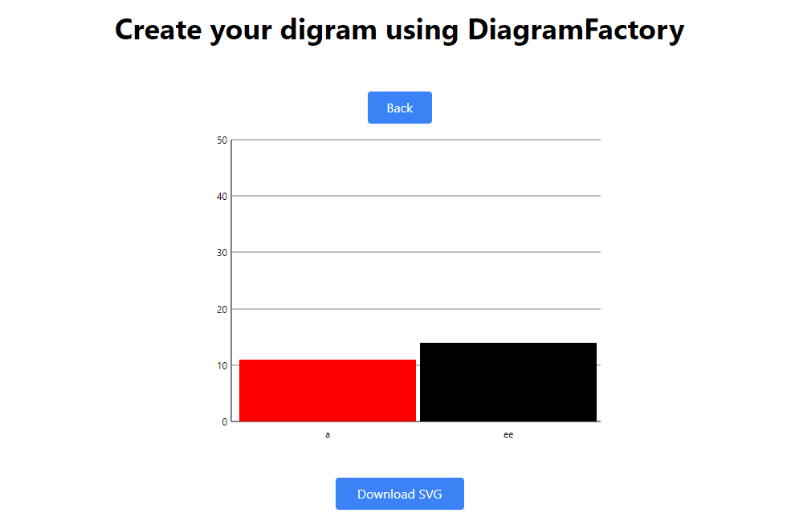
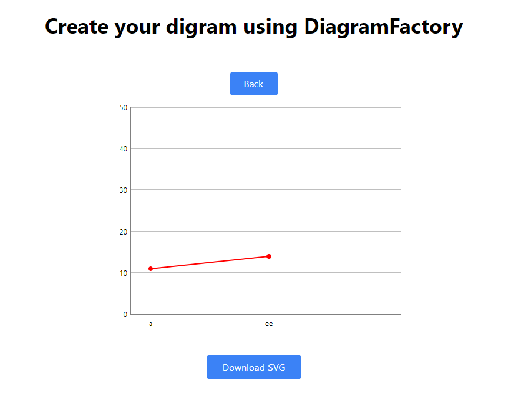
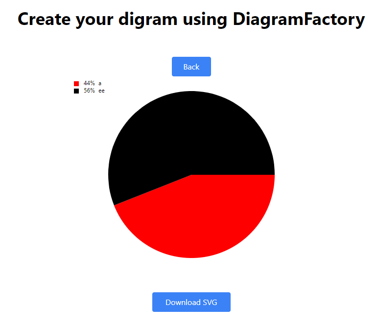
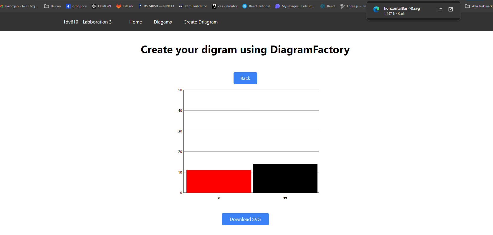

# TestRapport

## Introduction
The purpose of this document is to provide a test report for the project. The project is a web application that allows users to create a various different types of diagrams.

During this test phase, we will focus on verifying the functionality of the application. We will also verify that the application is user-friendly and that it is easy to use.

## Test Environment
The application is designed to be tested in a web environment, specifically on the client side, within various browser platforms. The testing process includes only manual tests.

## Manual Testing:
Manuel test cases focus on the user experience and the functionality of the application.

### Browsers:
- Google Chrome (latest version)

### Devices:
- Desktop: High-resolution (1920x1080)
- Laptop: Standard resolution (1366x768)

## Test Cases

### Automated Test Cases

There is 3 automated test cases that have been created to verify that the webcomponents are rendered in the DOM.

- Total number of test cases: 3
- Test cases passed: 3
- Test cases failed: 0

### Manual Test Cases

For manual testing, a series of test cases were created to verify the functionality of the application. To start the test, the user must open the application in a browser and follow the steps below.

To start the manuel test cases, the user must open the application in a browser and follow the steps below.

1. Navigate to the application URL: [DiagramFactory](https://1dv610-labboration-3-production.up.railway.app/)
2. Follow the different tesc cases below.

| Test Case ID | Name | Status |
|--------------|------|--------|
| TC1 | Verify that the application HOME page loads correctly. | PASS |
| TC2 | Verify that the application HORIZONTALBAR page loads correctly. | PASS |
| TC3 | Verify that the application LINEDIAGRAM page loads correctly. | PASS |
| TC4 | Verify that the application CIRCLEDIAGRAM page loads correctly. | PASS |
| TC5 | Verify that the application CREATE DIAGRAM page loads correctly. | PASS |
| TC6.1 | Verify that the application CREATE DIAGRAM option works to create a BarDiagram. | PASS |
| TC6.2 | Verify that the application CREATE DIAGRAM option works to create a LineDiagram. | PASS |
| TC6.3 | Verify that the application CREATE DIAGRAM option works to create a CircleDiagram. | PASS |
| TC6.4 | Verify that the application CREATE DIAGRAM option works to create a HorizontalBarDiagram then a LineDiagram. | PASS |
| TC6.5 | Verify that the application CREATE DIAGRAM option works to download a diagram. | PASS |

### TC1: Verify that the application HOME page loads correctly.
1. Click on Home in the navbar.
2. Verify that the Home page loads correctly. With no text or element overlapping. Also verify that there is 3 different diagrams on the home page.

#### Expected Result:
The Home page should load correctly with no text or element overlapping. Also verify that there is 3 different diagrams on the home page.

### TC2: Verify that the application HORIZONTALBAR page loads correctly.
1. Click on Diagram in the navbar.
2. You should the be on the HorizontalBar page.
3. Scroll down and verify that the HorizontalBar page loads correctly. With no text or element overlapping. Verify that there is a horizontal bar diagram on the page.

#### Expected Result:
The HorizontalBar page should load correctly with no text or element overlapping. Verify that there is a horizontal bar diagram on the page.

### TC3: Verify that the application LINEDIAGRAM page loads correctly.
1. Click on Diagram in the navbar.
2. Click on LineDiagram in the new menu.
3. You should the be on the LineDiagram page.
4. Scroll down and verify that the LineDiagram page loads correctly. With no text or element overlapping. Verify that there is a line diagram on the page.

#### Expected Result:
The LineDiagram page should load correctly with no text or element overlapping. Verify that there is a line diagram on the page.

### TC4: Verify that the application CIRCLEDIAGRAM page loads correctly.
1. Click on Diagram in the navbar.
2. Click on CircleDiagram in the new menu.
3. You should the be on the CircleDiagram page.
4. Scroll down and verify that the CircleDiagram page loads correctly. With no text or element overlapping. Verify that there is a circle diagram on the page.

#### Expected Result:
The CircleDiagram page should load correctly with no text or element overlapping. Verify that there is a circle diagram on the page.

### TC5: Verify that the application CREATE DIAGRAM page loads correctly.
1. Click on Create Diagram in the navbar.
2. You should the be on the Create Diagram page.
3. Verify that the Create Diagram page loads correctly. With no text or element overlapping. Verify that there is a create diagram option on the page.

#### Expected Result:
The Create Diagram page should load correctly with no text or element overlapping. Verify that there is a create diagram option on the page.

### TC6:
1. Click on Create Diagram in the navbar.
2. Enter a label for the diagram.
3. Enter a value for the diagram.
4. Select a color for the diagram.
5. Click on Add.
6. Click on Add new input button.
7. Enter the new label, value and select a color.
8. Click on Add.

Continue to TC6.1, TC6.2, TC6.3

### TC6.1: Verify that the application CREATE DIAGRAM option works to create a BarDiagram.
9. It will then create a new option for you to select the bar diagram.
10. Click on Create Diagram.

#### Expected Result:
The application should create a BarDiagram with the values you entered.

### TC6.2: Verify that the application CREATE DIAGRAM option works to create a LineDiagram.
9. It will then create a new option for you to select the line diagram.
10. Click on Create Diagram.

#### Expected Result:
The application should create a LineDiagram with the values you entered.

### TC6.3 Verify that the application CREATE DIAGRAM option works to create a CircleDiagram.
9. It will then create a new option for you to select the line diagram.
10. Click on Create Diagram.

#### Expected Result:
The application should create a CircleDiagram with the values you entered.

### TC6.4: Verify that the application CREATE DIAGRAM option works to create a HorizontalBarDiagram then a LineDiagram.
9. It will then create a new option for you to select the HorizontalBarDiagram 
10. Click on Create Diagram.
11. Click on the button Back.
12. Select a LineDiagram type.
13. Click on Create Diagram.

#### Expected Result:
The application should create a HorizontalBarDiagram with the values you entered. Then you should be able to go back and select a new diagram type and create a new diagram.

### TC6.5: Verify that the application CREATE DIAGRAM option works to download a diagram.
9. It will then create a new option for you to select the line diagram.
10. Click on Create Diagram.
11. Click on the button Download.

#### Expected Result:
The application should create a CircleDiagram with the values you entered. Then you should be able to download the diagram. The diagram should be downloaded as a SVG file.

## Known Issues
- Only svg element is supported for download.
- The interactivity and animation are not supported on downloaded svg files.

## BugReports
| Issue ID | Description | Status | Priority | Remarks |
|----------|-------------|--------|----------|---------|
| BUG001 | The interactivity and animation are not supported on downloaded svg files. | open | minor | Requires update to interaction logic |

## Conclusion
The application has been tested and verified to be working as expected. The application is user-friendly and easy to use. The test cases have been successfully executed and the application has passed all the test cases.
